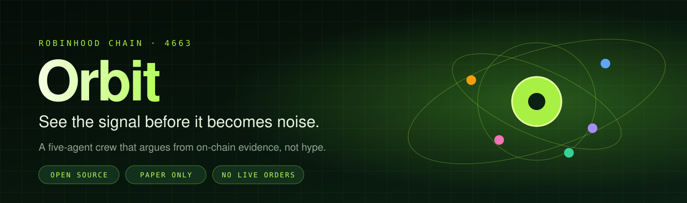
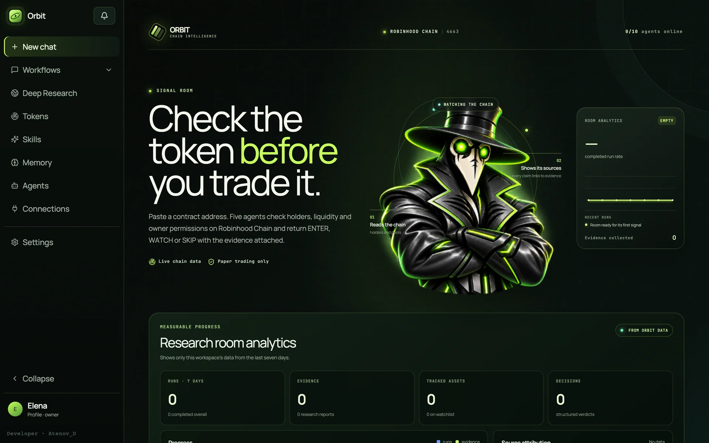
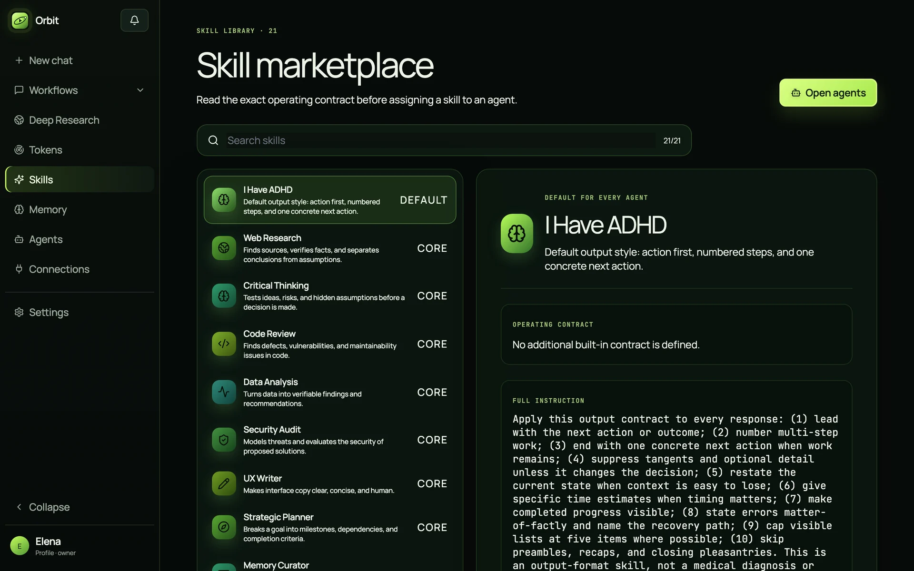
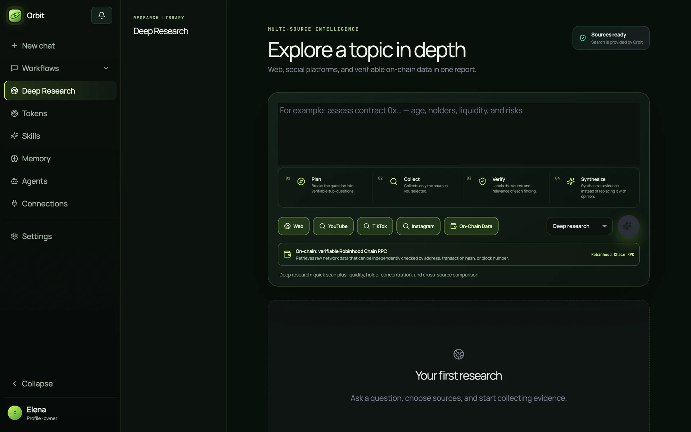
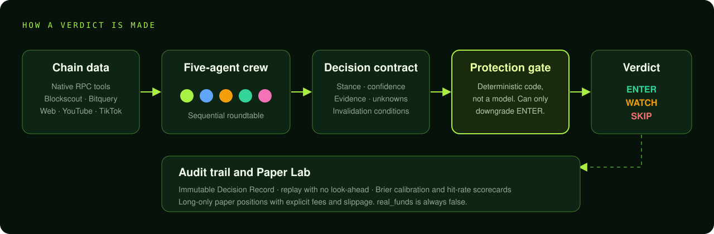

<p align="center">
  
</p>

<p align="center">
  <a href="https://github.com/AtenovD/orbit-chain-intelligence/actions/workflows/ci.yml"></a>
</p>

<p align="center">
  <a href="https://github.com/AtenovD/orbit-chain-intelligence/stargazers"></a>
  <a href="https://github.com/AtenovD/orbit-chain-intelligence/blob/main/LICENSE"></a>
  <a href="https://github.com/AtenovD/orbit-chain-intelligence/commits/main"></a>
</p>
<p align="center">
  
  
  
  
  
  
  
</p>

<p align="center">
  Paste a Robinhood Chain contract address and five AI agents check its holders, liquidity and owner permissions, then return ENTER, WATCH or SKIP with linked evidence. Paper trading only. No live orders, ever.
</p>

<h3 align="center">Every verdict comes with its evidence.<br>A protection gate written in code, not a prompt, decides whether an ENTER survives.</h3>

<table align="center">
  <tr>
    <td align="center"></td>
    <td align="center"><a href="#quick-start"></a></td>
    <td align="center"></td>
    <td align="center"><a href="#quick-start"></a></td>
  </tr>
  <tr>
    <td align="center"></td>
    <td align="center"><a href="#how-a-verdict-is-made"></a></td>
    <td align="center"></td>
    <td align="center"><a href="#feature-map"></a></td>
  </tr>
  <tr>
    <td align="center"></td>
    <td align="center"><a href="#bring-your-own-model"></a></td>
    <td align="center"></td>
    <td align="center"><a href="#quick-start"></a></td>
  </tr>
  <tr>
    <td align="center"></td>
    <td align="center"><a href="#feature-map"></a></td>
    <td align="center"></td>
    <td align="center"><a href="#feature-map"></a></td>
  </tr>
  <tr>
    <td align="center"></td>
    <td align="center"><a href="#feature-map"></a></td>
    <td align="center"></td>
    <td align="center"><a href="docs/DEPLOYMENT_RU.md"></a></td>
  </tr>
</table>

<p align="center">
  
</p>

---

## Why Orbit

A language model can write a convincing case for any token. Orbit treats that as a proposal to be checked:

> **A model may propose. Only deterministic code may promote.**

Five agents with distinct working styles debate a token in a live, interruptible conversation. Every contribution is a structured signal with evidence you can click through. A protection gate written in plain code — not a prompt — decides whether an `ENTER` survives. Everything ends in an immutable receipt and a paper-only ledger, so you can measure whether the crew is actually any good.

**Orbit never places a real order. There is no execution engine, wallet or broker integration.**

## Feature map

<table>
<tr>
<td width="50%" valign="top">

### 🧠 The crew
Five default characters — **Captain, Tactician, Scout, Forge, Sentinel** — each with a role, objective, budget, professional memory and skill slot. Run up to ten agents per dialogue, edit the roster mid-run, redirect the goal, or interrupt with a targeted message.

</td>
<td width="50%" valign="top">

### ⛓️ Native chain tools
Direct **Robinhood Chain RPC** tools — no MCP required. Contract identity, holders, pools, proxy/admin storage, mint and pause surfaces. Optional Blockscout and Bitquery connectors import holder snapshots and DEX trades.

</td>
</tr>
<tr>
<td valign="top">

### 📜 Decision Contract v1
Every reply carries a hidden, versioned `AgentSignal`: stance, calibrated confidence, evidence, assumptions, unknowns, blocking risks and invalidation conditions. The chat stays concise; the full signal is kept as an auditable artifact.

</td>
<td valign="top">

### 🛡️ Protection gate
`ENTER` is reduced to `WATCH` or `SKIP` on failed tasks, blocking risks, low confidence, stale signals, paused execution or too little *independently checkable* evidence. Protections can only lower a verdict, never raise one.

</td>
</tr>
<tr>
<td valign="top">

### 🧾 Decision Record
Each finished turn produces an immutable JSON receipt: team, tasks, signals, tool calls, protection outcome and artifacts — rendered in the Dialogue Audit panel with the exact evidence references behind every claim.

</td>
<td valign="top">

### 🧪 Paper Lab
Capture executable DEX observations, open protection-approved **paper** positions, close them against later observations and keep fees, adverse slippage and P&L. Positions are long-only and always `real_funds: false`.

</td>
</tr>
<tr>
<td valign="top">

### 📈 Replay and scorecards
Verdicts are replayed only against observations *after* their timestamp — no look-ahead. Scorecards report directional hit-rate and Brier calibration per agent. Measurements are observational: they never silently change prompts, models or sizing.

</td>
<td valign="top">

### 🔎 Deep Research
One report across Web, YouTube, TikTok, Instagram and on-chain data, with query expansion, evidence IDs, per-source status and stated limitations.

</td>
</tr>
<tr>
<td valign="top">

### 🧬 Memory v2
Compact dialogue notes, shared workspace memory, hybrid lexical + vector retrieval with provenance, and agent lessons that stay *proposals* until a human approves them. One-click Markdown export.

</td>
<td valign="top">

### 🔌 Skills, MCP and connectors
A 21-skill marketplace with readable operating contracts. MCP catalog over stdio and Streamable HTTP with approval gates for risky actions. GitHub, Notion, Slack, Google Drive, Telegram, YouTube and X connectors.

</td>
</tr>
</table>

<br>

<p align="center"> </p>

## How a verdict is made



For an `ENTER`, the default gate requires a valid structured contribution, confidence at or above the threshold, no declared blocking risk, and at least one unique evidence item with **both a source and a concrete reference** — a URL, transaction hash, block, document location or tool-call ID. Evidence without a reference stays visible in the audit but does not count as independently checkable. A workspace can raise `min_enter_confidence` or `min_enter_evidence_refs`; `execution_paused` is a hard stop.

## Bring your own model

Orbit never assumes what you pay or which model you use. Connect a key once and reuse it across agents.

| | |
|---|---|
| **Providers** | OpenAI-compatible endpoints, Anthropic native Messages API, Gemini, plus a catalogue of 20+ presets (Groq, DeepSeek, OpenRouter, Kimi, MiniMax, Ollama, LM Studio, vLLM and more) |
| **Setup** | Three-step wizard, live key verification, automatic model discovery, Custom API base-URL auto-detection |
| **Safety** | Provider credentials encrypted at rest (Fernet); retry with backoff and up to three fallback connections |
| **Cost** | Token counts come from provider responses; USD cost stays `0` unless you configure per-million prices |
| **Local** | A built-in `mock` provider runs the whole app with **no API keys** |

## Also included

- **Durable runtime** — database checkpoints, task attempts, pause/resume/cancel, crash recovery and multi-worker leases; live events over reconnectable SSE with replay.
- **Workflow nodes** — agent, review, condition, parallel, human input, approval, MCP tool, artifact, final output. Standard and Constructive (explicit objections) modes.
- **Accounts** — HttpOnly sessions, password recovery, workspaces with owner/admin/member/viewer roles, per-account daily quotas.
- **Materials** — TXT, Markdown, code, JSON, CSV, HTML, PDF and DOCX are checked, stored and extracted before a run starts.
- **Interface** — RU/EN, responsive down to phones, local fonts, accessible dialogs.
- **Ops** — Docker Compose + Caddy (automatic TLS), health endpoint, backup / restore / verify / off-site upload scripts.

## Quick start

No API keys needed; the local profile uses the mock provider.

```bash
git clone https://github.com/AtenovD/orbit-chain-intelligence.git
cd orbit-chain-intelligence
./scripts/start.sh          # macOS / Linux
# .\Start-Orbit.ps1         # Windows
```

Open <http://127.0.0.1:8000>. API docs live at `/docs`.

<details>
<summary><b>Manual development setup</b></summary>

```bash
python3 -m venv .venv && source .venv/bin/activate
pip install -e ".[dev]"
python scripts/bootstrap_db.py      # local SQLite schema
(cd frontend && npm install && npm run build)
uvicorn orchestrator.main:app --reload
```

For the Vite dev server run `npm run dev` inside `frontend/`.

</details>

<details>
<summary><b>Production deployment</b></summary>

Copy `.env.example` to `.env` and set at minimum:

```env
APP_ENV=production
AUTH_REQUIRED=true
DATABASE_URL=postgresql+asyncpg://orbit:<password>@postgres:5432/orbit
SECRET_ENCRYPTION_KEY=<fernet-key>
CORS_ORIGINS=https://your-domain.example
```

```bash
python -c "from cryptography.fernet import Fernet; print(Fernet.generate_key().decode())"
docker compose -f compose.yaml -f compose.production.yaml up --build -d
```

Migrations (`alembic upgrade head`) run before the server starts on PostgreSQL, and Caddy obtains TLS automatically. Configure `DOMAIN`, `PUBLIC_URL` and SMTP as described in `.env.example`. A Russian-language VPS runbook with backup notes is in [docs/DEPLOYMENT_RU.md](docs/DEPLOYMENT_RU.md).

</details>

## Architecture

```text
frontend/            React + Vite + TypeScript single-page app
src/orchestrator/    FastAPI application
  runtime.py         durable run engine, checkpoints, leases
  decision_contracts.py · protections.py · verdict.py
  paper_trading.py   paper ledger, replay, scorecards
  chain_tools.py     Robinhood Chain RPC tools
  providers.py       model connections and discovery
  memory.py · research.py · mcp.py · skill_catalog.py
migrations/          Alembic revisions (PostgreSQL)
scripts/             start, backup, restore, verify, health check
tests/               backend suite (pytest)
```

## Tests

```bash
python -m pytest -q
cd frontend && npm run test -- --run && npm run lint && npm run build
```

## Disclaimer

Orbit is research software. Its output is not financial advice, and the paper ledger is not a broker, exchange or execution engine. Tokens launched on any chain can be worthless. Do your own research.

## License

[MIT](LICENSE)
